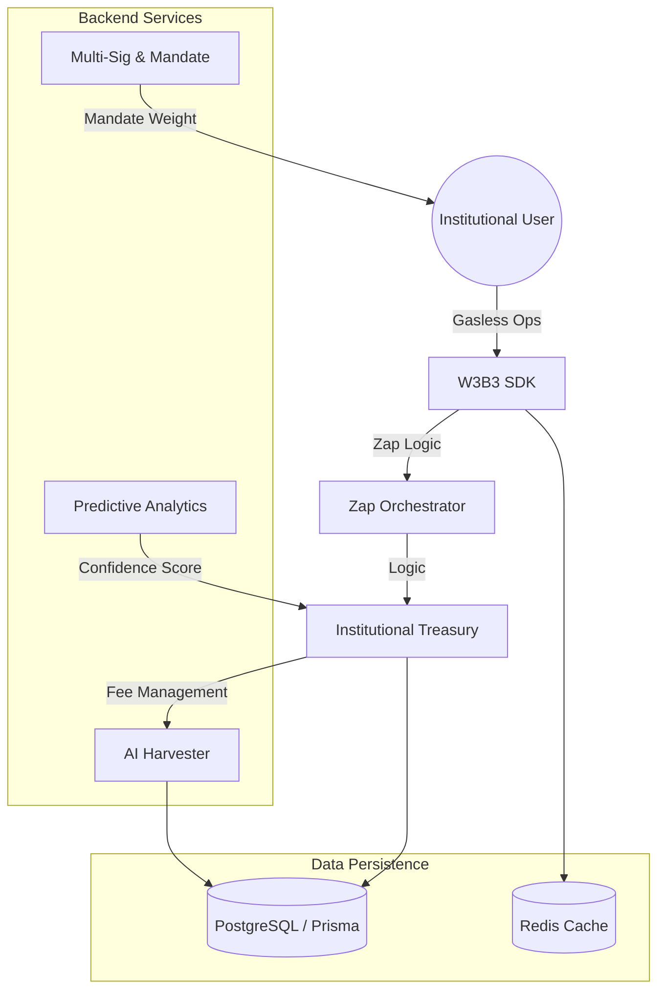

# 🛰️ W3B3: Industrial-Grade Real-Yield Marketplace
## Implementation Roadmap V2: The Final Vision

> **PHASES 1-13 SHIPPED** | **STATUS**: GOLD MASTER (PROTOCOL COMPLETE) | **DATE**: APRIL 14, 2026

---

## 🏛️ System Architecture

---

## 💎 Completed Milestone Highlights

### ⚡ Phase 1-5: The Infrastructure
*   **Wagmi 2.x & RainbowKit 2.x**: Re-engineered the frontend for industrial stability.
*   **Account Abstraction (ERC-4337)**: Native support for gasless, multi-sig, and biometric transactions.
*   **Autonomous Seeding**: Automated build-time database bootstrapping for production readiness.

### 🧠 Phase 6-10: The Intelligence & Interactive Layer
*   **Predictive APY Models**: ML engines forecasting 7-day trajectories with 85%+ confidence scores.
*   **Autonomous Harvesters**: AI agents that rebalance positions based on gas-efficient decay models.
*   **Premium Marketplace**: Glassmorphic analytics and high-fidelity historical sparklines for all assets.

### 🏛️ Phase 11-13: Institutional Graduation (The Final Frontier)
*   **Platinum Scaling**: 35-asset blue-chip registry operational and live-syncing.
*   **Institutional Custody**: Native Multi-Sig Vaults with weighted governance and approval rails.
*   **Keyless Analytics Suite**: Pro-grade TradingView & Throttled CoinGecko resilience (Zero-Key).
*   **Governance Mandate**: Voting Power & Yield Multiplier logic (up to 1.5x) fully operational.

---

## 🌍 Global Impact Vision
> *“To become the decentralized settlement layer for institutional and retail liquidity, providing frictionless access to global real-yield opportunities through AI-driven capital efficiency.”*

---

### 🛡️ Verified Production State
- [x] **Type-Safety**: 100% clean `tsc` monorepo build.
- [x] **Database**: Operational Render PostgreSQL with `sslmode=require`.
- [x] **Networking**: Protocol-strict CORS and environment-validated routing.

---
*Created by: Antigravity AI | Authorized Deployment*
