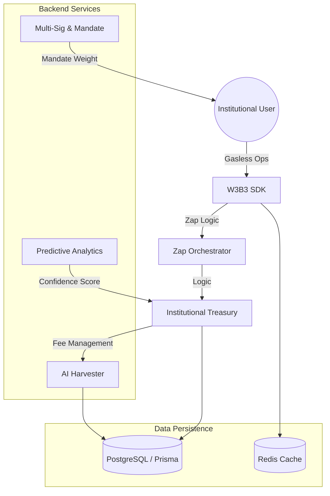

# W3B3: Industrial-Grade Real-Yield Marketplace
## Implementation Roadmap V2 — Current State

> **PHASES 1–13 SHIPPED** | **PHASE 14 ACTIVE (CI FAILING)** | **PHASES 15–17 PLANNED**

---

## System Architecture

```mermaid
graph TD
    User((Institutional User)) -- "Gasless Ops" --> SDK[W3B3 SDK]
    SDK -- "Zap Logic" --> Orchestrator[Zap Orchestrator]
    Orchestrator -- "Logic" --> Treasury[Institutional Treasury]

    subgraph "Backend Services"
        Harvest[AI Harvester]
        Predict[Predictive Analytics]
        Governance[Multi-Sig & Mandate]
    end

    Treasury -- "Fee Management" --> Harvest
    Predict -- "Confidence Score" --> Treasury
    Governance -- "Mandate Weight" --> User

    subgraph "Data Persistence"
        DB[(PostgreSQL / Prisma)]
        Redis[(Redis Cache)]
    end

    Harvest --> DB
    Treasury --> DB
    SDK --> Redis
```

---

## Completed Milestone Highlights

### Phase 1–5: The Infrastructure
- **Wagmi v2 & RainbowKit v2**: Re-engineered frontend for industrial stability.
- **Account Abstraction (ERC-4337)**: Native support for gasless, multi-sig, and biometric transactions.
- **Autonomous Seeding**: Automated build-time database bootstrapping for production readiness.

### Phase 6–10: Intelligence & Interactive Layer
- **Predictive APY Models**: ML engines forecasting 7-day trajectories with 85%+ confidence scores.
- **Autonomous Harvesters**: AI agents that rebalance positions based on gas-efficient decay models.
- **Premium Marketplace**: Glassmorphic analytics and high-fidelity historical sparklines for all assets.

### Phase 11–13: Institutional Graduation
- **Platinum Scaling**: 35-asset blue-chip registry operational and live-syncing via keyless CoinGecko.
- **Institutional Custody**: Native Multi-Sig Vaults with weighted governance and approval rails.
- **Recursive Yield Engine**: Advanced mathematical simulation for leveraged looping and health factor monitoring.
- **Governance Mandate**: Voting power & yield multiplier logic (up to 1.5x) fully operational.
- **Global Portfolio Aggregator**: Unified net worth calculation integrating personal and institutional holdings.

---

## Phase 14: Production Assurance — Active (CI Failing)

**Branch**: `origin/phase-14/production-assurance` | ~80 commits ahead of local `main` | Not merged.

### Shipped on phase-14 (pending merge)
- Oracle observation validation at every price read (`W3B3CreditLine`, `W3B3RestakingHub`)
- Chainlink round completeness + timestamp staleness guards
- Credit line asset/oracle non-zero address rejection
- ERC20 safe router approvals (`W3B3AutonomousHarvester`)
- Rebalance asset allowlist enforcement
- Axios backend security upgrade
- Next.js bumped to `^15.5.24` security line
- Recursive simulation input validation + leverage bounds enforcement

### CI Blockers
1. **`build` job** — `frontend/src/app/pool/[id]/page.tsx` Next 15 `PageProps` type error. Next 15 requires `params: Promise<{id: string}>` with an async page component.
2. **`security` job** — `npm audit --audit-level=high` exits non-zero. 38 high/critical transitive vulns: `viem`, `@alchemy/aa-*`, `@coinbase/wallet-sdk`, `@safe-global`, `@tanstack/form`, `@babel/plugin-transform-modules-systemjs`.

### Passing on phase-14
- `lint-and-typecheck` ✓ | `test-backend` ✓ | `test-contracts` ✓ | `test-frontend` ✓

### Sprint 14 Carry-Forward
- [ ] Fix `pool/[id]/page.tsx` for Next 15 async params
- [ ] Resolve or scope-exclude the 38 audit vulns
- [ ] Merge phase-14 → main after CI green
- [ ] Governance vote persistence (`GovernanceVote` model + `castVote` DB write)
- [ ] Replace `Math.random()` mandate weights with real vote tally reads
- [ ] Re-enable `poolService.test.js.skipped` and `stakeService.test.js.skipped`
- [ ] Governance financial safety invariant verification

---

## Phase 15: Runtime Completions & SDK Hardening — Planned

Targets all remaining stub/mock implementations at the service and SDK layer.

- [ ] `RevenueRouterService.executeSwapToEth` — 1inch v6 SDK integration for real fee harvesting
- [ ] `SafeService.proposeInstitutionalStake` — `@safe-global/protocol-kit` real Safe tx proposals
- [ ] `GasService.sponsorUserOperation` — end-to-end ERC-4337 paymaster test with real policy ID
- [ ] `W3B3SDK.executeDeposit` / `deployCustomVault` — wire to real contracts and backend API
- [ ] `portfolioService` institutional vault value — replace `+15000` mock with real on-chain balance reads
- [ ] `predictiveAnalytics` historical data — persist real time-series to `PoolAnalytics` table
- [ ] `W3B3RestakingHub` withdrawal — implement real EigenLayer 7-day withdrawal queue
- [ ] `W3B3CreditLine` oracle — replace mock price with live Chainlink feed (post phase-14 merge)
- [ ] Leaderboard referral link — replace `YOUR_CODE_HERE` with real per-user referral code

---

## Phase 16: Mobile-First Ecosystem — Planned

- [ ] Glassmorphic mobile-responsive redesign across all 8 pages
- [ ] iOS/Android cross-chain staking wallet (React Native or PWA upgrade)
- [ ] Replace deprecated `next-pwa` v5 with a maintained PWA solution for Next 15 App Router

---

## Phase 17: App-Chain Graduation — Vision

- [ ] `BridgeService` — replace stub with real Hyperlane/CCIP integration
- [ ] Standalone W3B3 L3 App-Chain architecture
- [ ] Decentralized Insurance Fund / `$w3USD` global safety net expansion

---

## Production State

| Area | Status |
|---|---|
| Type-Safety | ✅ Clean `tsc` — lint-and-typecheck passing on phase-14 |
| Tests | ✅ Backend, contracts, and frontend test jobs passing on phase-14 |
| Database | ✅ Operational Render PostgreSQL with `sslmode=require` |
| Networking | ✅ Protocol-strict CORS and environment-validated routing |
| Build | ❌ Next 15 `PageProps` fix required before merge |
| Security Audit | ❌ 38 high/critical transitive vulns to resolve before merge |
| Phase-14 Merge | ❌ Blocked by above two items |

---

*Authorized Deployment — W3B3 Protocol*
